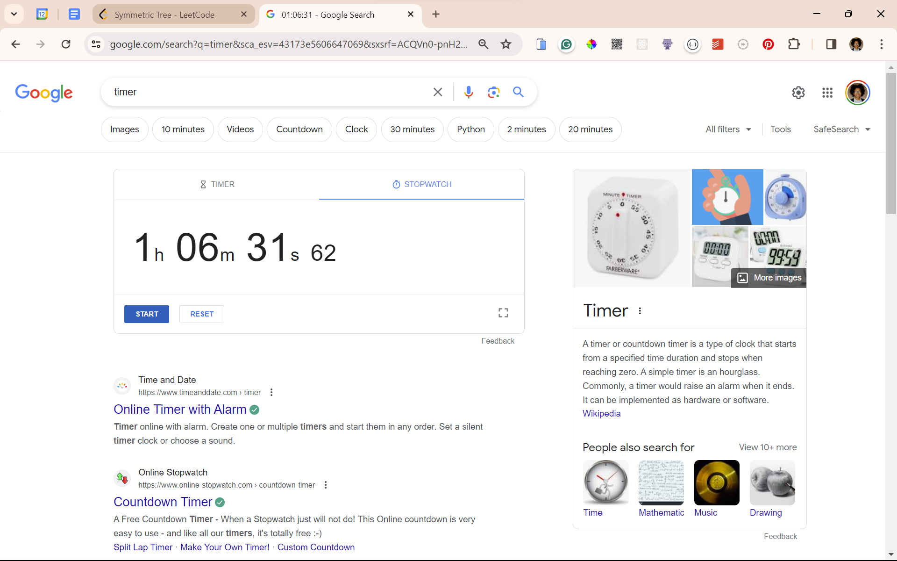
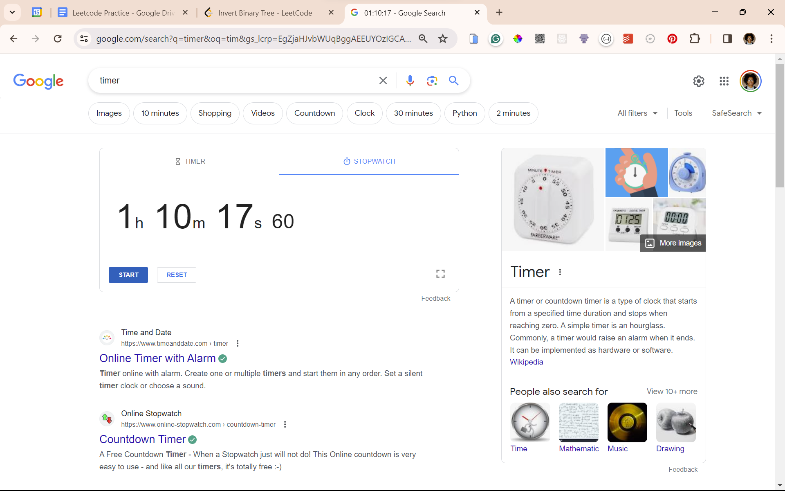

# Solution Reflections
**Reflection Guide**:
* "*Initial Approach*" covers my initial approach(es)
* "*Solution Approach*" covers the approach I used that was accepted by all Leetcode testcases
* "*Optimal Approach*" covers an approach I saw in the submissions which I deemed to be more intuitive or easier than mine
* A single asterisk (*) by a point is used to indicate that an analysis as based on a Google search
* A double question mark (??) by a point is used to indicate a lack of trust in my personal analysis

## Tree Problems

### #100 Same tree
⌛08:35:97 &nbsp;&nbsp; | &nbsp;&nbsp; See problem [here](https://leetcode.com/problems/same-tree/)

* Solution Approach: {RECURSIVE} → **O(n)**, **O(n)**
  * Store BFS traversal of each tree in a list → Traverse both lists and return true if the lists are the same; return false is they are not
  * Edge cases:
    * If both trees are empty, automatically return true
    * If only one tree is empty, automatically return false
  * RECURSIVE APPROACH:
    * Base case: If cur is None, add nothing to list
    * General case: Add cur's val to list. Call function recursively on left and right children.
* Optimal Approach: ?? → **O(??)**, **O(??)**

### #563 Binary tree tilt
⌛49:48:16 &nbsp;&nbsp; | &nbsp;&nbsp; See problem [here](https://leetcode.com/problems/binary-tree-tilt/)

**NOTE**: Most of the time was taken walking through the problem.

* Solution Approach: {RECURSIVE}  → **O(n)**, **O(n)**
  * IDEA: Return all children and sum of all tilts so far with 
    **NOTE**: This was my second attempt. I got this idea by going through an example step by step and visualising what I want the function to return from each level of the recursive stack. 
  * RECURSIVE APPROACH:
    * Base case: If cur is None, return a list of no children and a sum tilt of 0
    * General case:
      1. Call the function recursively on the left and right children and store the results
      2. Get the tilt by adding the tilt of the left and the tilt of the right to the tilt of the current node
      3. Get the new children by adding cur's val to the children of the left and the right
      4. Return the new children and the tilt in a tuple
* Optimal Approach: ?? → **O(n)**, **O(1)**

### #101 Symmetric tree
⌛01:06:31:62 &nbsp;&nbsp; | &nbsp;&nbsp; See problem [here] (https://leetcode.com/problems/symmetric-tree/)

* Initial Approach:
  1. Store the in-order traversal of the tree while distinguishing leaf nodes from a null child
  2. Return true if the beginning half of the list is the same as the reverse of the last half of the list
  3. Return false otherwise
   → **O(n)**, **O(n)**

**NOTE**: This does not actually qualify as an initial approach as it only passed 189 of 199 tests. I stopped trying after a while (see the image below).

### #226 Invert binary tree
⌛08:35:97 &nbsp;&nbsp; | &nbsp;&nbsp; See problem [here](https://leetcode.com/problems/invert-binary-tree/)

* Initial Approach: Content → **O(n)**, **O(1)**
* Solution Approach: Content → **O(n)**, **O(1)**
* Optimal Approach: Content → **O(n)**, **O(1)**

### #572 Subtree of another tree
⌛08:35:97 &nbsp;&nbsp; | &nbsp;&nbsp; See problem [here](https://leetcode.com/problems/subtree-of-another-tree/)

* Initial Approach: Content → **O(n)**, **O(1)**
* Solution Approach: Content → **O(n)**, **O(1)**
* Optimal Approach: Content → **O(n)**, **O(1)**

## Markdown Resources
GitHub Emojis: https://github-emoji-picker.rickstaa.dev/