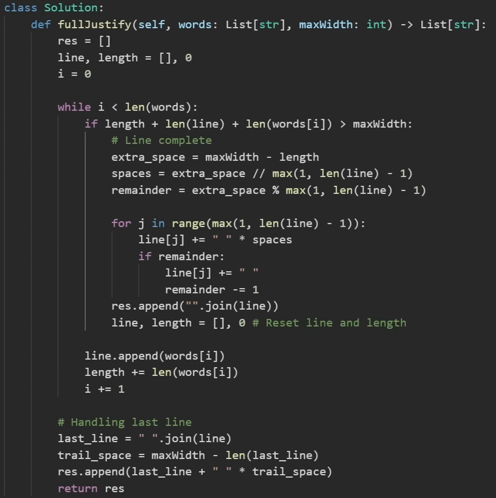

# Solution Reflections
**Reflection Guide**:
* "*Initial Approach*" covers my initial approach(es)
* "*Solution Approach*" covers the approach I used that was accepted by all Leetcode testcases
* "*Optimal Approach*" covers an approach I saw in the submissions which I deemed to be more intuitive or easier than mine
* A single asterisk (*) by a point is used to indicate that an analysis as based on a Google search
* A double question mark (??) by a point is used to indicate a lack of trust in my personal analysis
* --:--:-- in the time slot means that I couldn't solve it on my own

## Sorting Algorithm Problems

### #88 Merge Sorted Array
⌛47:57:45 &nbsp;&nbsp; | &nbsp;&nbsp; See problem [here](https://leetcode.com/problems/merge-sorted-array/description/?envType=study-plan-v2&envId=top-interview-150)

* Initial Approach: → **O(n+m)**, **O(n+m)**
  * **IDEA**: Use pointers and a temp array.
  * Edge case:
    * If nums2 is empty, don't do anything else
    * If nums1 is empty, move everthing in nums2 to nums1 and don't do anything else
  * **ALGORITHM**:
    1. Have pointers i and j to the beginnings of nums1 and nums2, respectively
    2. If nums1[i] is less than nums2[j], append nums1[i] to the temp array and increment i by 1
    3. Else, append nums2[j] to the temp array and increment j by 1
    4. Continue until either all the elements in nums1 or nums2 has been accounted for
    5. Add the remaining elements in nums1 or nums2 (if they exist) to the temp array
    6. Reassign nums1 to the temp array
* Solution Approach: → **O(n+m)**, **O(1)**
  * **IDEA**: Use pointers but start from the back of nums1 so you don't need a temp array
  * **ALGORITHM**:
    1. Have pointers i, j and k to point to the end of nums1 elements, nums2 and nums1, respectively
    2. If nums1[i] is greater than nums2[j], assign nums1[k] to nums1[i] and decrement i by 1
    3. Else, assign nums1[k] to nums1[i] and decrement i by 1
    4. Continue until either all the elements in nums1 or nums2 has been accounted for
    5. Add the elements remaining at the beginning nums2 to the beginning of nums1 (if they exist)

**THOUGHTS**: Wow this took so long, I am so so very afraid of how long things are going to take me if an Easy array question took me this long. Not a good start.

**NOTE**: Always, always step through the code with a sample case.

### #88 Remove Element
⌛51:21:63 &nbsp;&nbsp; | &nbsp;&nbsp; See problem [here](https://leetcode.com/problems/remove-element/description/?envType=study-plan-v2&envId=top-interview-150)

* Initial Approach:
  * 
* Solution Approach: → **O(n logn)**, **O(n)**
  * **IDEA**: 
  * **ALGORITHM**:
    1. 
  * Improvements:
    1. 
* Optimal Approach: 
  * 

**THOUGHTS**: No f***ing way, bro. The time stamps for these FIRST two ARRAY questions has me wondering at my general capability. 

**NOTE**: Do a better job with identifying and stepping through code with edge cases.

### #26 Remove Duplicates from Sorted Array
⌛17:12:93 &nbsp;&nbsp; | &nbsp;&nbsp; See problem [here](https://leetcode.com/problems/remove-duplicates-from-sorted-array/description/?envType=study-plan-v2&envId=top-interview-150)

* Solution Approach: → **O(n)**, **O(1)**
  * **IDEA**: Use pointers to keep track of unique elements in the front of the array with non-unique elements swapped to the back
  * **ALGORITHM**:
    1. EDGE CASE: If the arrray has less than two elements, return the length of the array (an empty array has no unique elements and an array with one element has one unique element)
    2. Initialise pointers to the last index of the unique sub-array (first element i.e. index 0) and a parser pointer to the first element we are unsure is unique (second element i.e. index 1)
    3. While the parser has not exceeded the length of the array:
       1. If the last unique element and the current element are not the same, swap the current element with the element IN FRONT of the last unique element then increment the unique pointer
       2. Increment the parser pointer
    4. Return the index of the last unique element + 1

**THOUGHTS**: I have solved this before and I solved it a lot faster than the first time (see `../../leetcode_prep/1_arrays/arrays_26.py`). I learned from the lessons of the first two by making sure to step through the code and doing the same for edge cases I thought of. Good job, Chinwe.

### #88 Remove Duplicates from Sorted Array II
⌛48:45:57 &nbsp;&nbsp; | &nbsp;&nbsp; See problem [here](https://leetcode.com/problems/remove-duplicates-from-sorted-array-ii/?envType=study-plan-v2&envId=top-interview-150)

* Initial Approach: → **O(n)**, **O(1)**
  * **IDEA**: Use the same approach as with #26 but keep track of the number of times each unique element appears as well
  * **ALGORITHM**: Frankly, I created an algorithm based on my step-through and I am finding it hard to describe it. Just see `removeDuplicates_initial()`./arrays_80.py`
* Solution Approach: → **O(n)**, **O(1)**
  * **IDEA**: Initial approach, but remove the unnecessary swap
* Optimal Approach: 
  * [Solution by geekytaurus](https://leetcode.com/problems/remove-duplicates-from-sorted-array-ii/solutions/4511964/easy-o-n-python-java-go-c-beginner-friendly)
  * **IDEA**: Move elements to the modified subarray (length represented by u) if there are 2 or less of the current element
  * **ALGORITHM**:
    1. Initialize length pointer (u) to 1 (for the first element) and current frequency (f) to 1
    2. Iterate through the array, starting from index 1 (use "cur" to refer to element)
    3. If the cur is equal its prev, increment f. Else, reset f to 1
    4. If f <= 2, update the item after the modified array (i.e. u+1) with cur and increment u
    5. Continue until the end of the array

**NOTE**: I modified the variable names in the optimal solution for my own understanding. Also. it took me a while to create an "IDEA" sentence for the optimal solution - the "IDEA" sentence should be able to capture the core behind the algorithm. It is not the steps you take but WHY you took them (wod wod wod).

### #169 Majority Element
⌛04:12:11 &nbsp;&nbsp; | &nbsp;&nbsp; See problem [here](https://leetcode.com/problems/majority-element/description/?envType=study-plan-v2&envId=top-interview-150)

* Solution Approach: → **O(n logn)**, **O(1)**
  * **IDEA**: Sort the list and return the middle element >>> We can be sure that it is the middle element because the question tells us to assume that the majority element exists, which means there is an element which occurs more than len(nums)/2 times.
* Optimal Approach: → **O(n logn)**, **O(n)**
  * **IDEA**: [Boyer-Moore Majority Vote Algorithm](https://www.geeksforgeeks.org/boyer-moore-majority-voting-algorithm/)
  * **ALGORITHM**:
    1. Initialise count and candidate to 0 and None respectively
    2. For each element in nums
       1. If count is 0, update candidate to be the current element
       2. Increment or decrement count by 1 based on if candidate and the current element match, respectively
       3. Return candidate

**THOUGHTS**: I have already researched this algorithm before. I wonder if there is a way to keep in mind common algorithms already created to deal with certain problems...

**NOTE**: IT IS NOT ALWAYS A GIVEN THAT A MAJORITY ELEMENT EXISTS. This is an incomplete version of the Boyer-Moore Majority Vote algorithm, used becuase we are told to assume is that the majority element exists. The complete algorithm, after taking the steps already outlines, then counts the number of occurences of the majority candidate. If the count is greater than (n//2), it is the majority element; else, the majority element does NOT exist.

### #189 Rotate Array
⌛11:54:66 &nbsp;&nbsp; | &nbsp;&nbsp; See problem [here](https://leetcode.com/problems/rotate-array/description/?envType=study-plan-v2&envId=top-interview-150)

* Solution Approach: → **O(n)**, **O(n)**
  * **IDEA**: Use a temporary array to hold the elements in the rotated order then move them back to the original array.
  * **ALGORITHM**:
    1. Get the minimum number of rotations needed
    2. EDGE CASE: If k is 0 or a multiple of n, return
    3. Copy the array in the rotated order to a temporary array
    4. Copy the elements back to the original array
* Optimal Approach: 
  * [Solution by SonuDutta](https://leetcode.com/problems/rotate-array/solutions/5189694/easy-python-solution)
  * **ALGORITHM**:
    1. Get the minimum number of rotations needed
    2. Reverse the entire array in-place
    3. Reverse the first k elements in place
    4. Reverse the remaining n-k elements in place
   
**THOUGHTS**: How did this person come up with this? How did it occur to them? That's what I don't get.

### #121 Best Time to Buy and Sell Stock
⌛13:34:50 &nbsp;&nbsp; | &nbsp;&nbsp; See problem [here](https://leetcode.com/problems/best-time-to-buy-and-sell-stock/description/?envType=study-plan-v2&envId=top-interview-150)

* Solution Approach (FAILED): → **O(n2)**, **O(n)**
  * **IDEA**: Brute force approach >>>  Get every possible combination of buy and sell days then select the max profit of these combinations
  * **ALGORITHM**:
    1. EDGE CASE: If there are less than 2 elements/days, return 0
    2. For each element/day (except the last one)
       1. calculate the maximum possible profit by getting the maximum potential sell day (potential sell day: any day after buy day) and subtracting the current element/day from it
       2. Add calculated profit to profits array if it is greater than 0; else (i.e. the maximum profit is actually a loss), add 0
    3. Return the maximum of the stored profits
  * Failed because it exceeded the time limit (9999ms) with very large arrays (stopped trying to solve @ 54:35:25)
* Optimal Approach #1: → **O(n)**, **O(1)**
  * [Modified Kadane's Algorithm](https://www.geeksforgeeks.org/largest-sum-contiguous-subarray/)
  * **ALGORITHM (original)**:
    1. Initialize the variables max_so_far = INT_MIN and max_ending_here = 0
    2. Run a for loop from 0 to N-1 and for each index i:
       1. Add the arr[i] to max_ending_here
       2. If  max_so_far is less than max_ending_here then update max_so_far  to max_ending_here
       3. If max_ending_here < 0 then update max_ending_here = 0
    3. Return max_so_far
  * **ALGORITHM (modified)**:
    1. Initialize the variables max_prof = INT_MIN and cur_prof = 0
     **NOTE**: cur_prof always returns to a minimun of 0 because, if we make a loss, we note the profit as 0, NOT the loss... lost
    2. For each index in range 0 to n-2 (because the last element canot have a profit):
       1. Add profit at this index (i.e. maximum value in potential sell days minus today) to cur_prof
       2. If  max_prof is less than cur_prof then update max_prof to cur_prof
       3. If cur_prof < 0 then update cur_prof = 0
    3. Return max_prof
  * See [Solution by nayankumarjha2](https://leetcode.com/problems/best-time-to-buy-and-sell-stock/solutions/4801758/2-steps-kadane-s-algorithm-brute-better-optimal-easy-video-explanation-in-hindi) for example implementation of a modified Kadane's algorithm
* Optimal Approach #2: → **O(n)**, **O(1)**
  * Based on understanding of [Neetcode's explanation, NOT code](https://www.youtube.com/watch?v=1pkOgXD63yU)
  * **IDEA**: Return the maximum profit of all minimum points of the graph
  * **ALGORITHM**:
    1. Initialise buy and sell days to day 0 and 1, respectively
    2. While there are valid sell days:
       1. If the buy day's price is greater than the sell day's price, update buy and sell date
       2. Else, set maxProfit to the larger of the buy and sell days (with valid relative prices) and update the sell day
        **NOTE**: Updating the minimum stock price (a.k.a. valid buy day) with a new one will not necessarily change the maxProfit; it is possible to have a lowest stock price which will not have as much as a profit as a higher stock price did.

    3. Return maxProfit
  * Improvements:
    *  I understand the intuition behind this one.

**NOTE**:
* I need to look for videos on Kadane's algorithm and make sure I understand HOW it works. As at now, I am unable to create an "IDEA" sentence.
* I implemented optimal approach #2 (no relation to Kadane's Algorithm) on my own and I consider that my solution 
  
### #122 Best Time to Buy and Sell Stock II
⌛07:49:18 &nbsp;&nbsp; | &nbsp;&nbsp; See problem [here](https://leetcode.com/problems/best-time-to-buy-and-sell-stock-ii/description/?envType=study-plan-v2&envId=top-interview-150)

* Solution Approach: → **O(n)**, **O(1)**
  * **IDEA**: Add each potential profit to a counter as you iterate in pairs
  * **ALGORITHM**:
    1. Initialise buy and sell days to day 0 and 1, respectively
    2. While there are possible sell days:
       1. If the buy day's value is less than the sell day's value, subtract them and add to the total variable
       2. Move buy and sell day indices forward by 1
    3. Return total variable

**THOUGHTS**: This is the second time I tried to solve this question. On my first attempt, I was entirely unsuccessful and stopped trying after 35+ minutes.

**NOTE**:
  * Draw out the thought process as direct as possible (this has to do with how I work through case studies; for this question, Neetcode draws out a graph).
  * This algorithm would NOT work well if I had to return the days on which to buy and sell

### #55 Jump Game
⌛--:--:-- &nbsp;&nbsp; | &nbsp;&nbsp; See problem [here](https://leetcode.com/problems/jump-game/description/?envType=study-plan-v2&envId=top-interview-150)

* Initial Approach (FAILED): → **O(nn)**, **O(n)** ??
  * **IDEA**: Go through every possible path as far up the array as you can go. Return when a possible path reaches the end
  * **ALGORITHM**: See comments of `canJump_FAILED()` function in `./array_string_55.py`
  * Failed because it did not solve 7 of 172 test cases
* Optimal Approach #1: **O(n2)**, **O(n)**
  * **IDEA**: Dynamic programming
  * [Solution by isharma6624](https://leetcode.com/problems/jump-game/solutions/5010031/dp-python-soln)
  * **ALGORITHM**: See comments of `canJump_optimal_1()` function in `./array_string_55.py`
* Optimal Approach #2: → **O(n)**, **O(1)**
  * Based on my understanding of [Neetcode's explanation, NOT code](https://www.youtube.com/watch?v=Yan0cv2cLy8)
  * **IDEA**: Start from the end and iteratively. Return whether or not the goalpost becomes 0 (i.e. we can reach the end from the start).
  * **ALGORITHM**: 
    1. Set the goalpost to the last index in the array
    2. For each index from the second to last to the first:
       1. If the current index + the element at the current index reaches/exceeds the goalpost, update the goalpost to the current index
    3. Return whether or not the goalpost is equal to 0

**THOUGHTS**:
* I tried to solve this problem two times to no avail; the first time lasted 56+ minutes and the second time 36+ minutes. I kept increasing in the number of test cases I was solving with each submission until I reached 165 out of 172.
* I had both of these ideas but I did not know how to implement them. Is there a way to improve that?
* I feel like a failure for having to find out Neetcode's thought process before I could code a solution. HOWEVER, I am also encouraged by the fact that I had the ideas for the brute and greedy algorithm approaches down (it was the implementation that I was struggling with).

**NOTE**:
* I need to practice dynamic programming questions because I was unable to code optimal approach #1 on my own.
* I implemented optimal approach #2 on my own and I consider that my solution.

### #45 Jump Game II
⌛--:--:-- &nbsp;&nbsp; | &nbsp;&nbsp; See problem [here](https://leetcode.com/problems/jump-game-ii/description/?envType=study-plan-v2&envId=top-interview-150)

* Optimal Approach: 
  * [Neetcode's explanation AND code](https://www.youtube.com/watch?v=dJ7sWiOoK7g)
  * **CODE**:
  

### #13 Roman to Integer
⌛50:08:53 &nbsp;&nbsp; | &nbsp;&nbsp; See problem [here](https://leetcode.com/problems/roman-to-integer/description/?envType=study-plan-v2&envId=top-interview-150)

* Solution Approach: → **O(n)**, **O(1)**
  * **IDEA**: Translate the characters from roman to integer in singles or pairs, depending on the value of the character after it

**THOUGHTS**: Literally want to k*** myself when I know what I want to do but I am implementing it like a buffoon.

### #12 Integer to Roman
⌛16:26:42 &nbsp;&nbsp; | &nbsp;&nbsp; See problem [here](https://leetcode.com/problems/integer-to-roman/description/?envType=study-plan-v2&envId=top-interview-150)

* Solution Approach: → **O(n)**, **O(1)**
  * **IDEA**: Iteratively remove the largest possible roman equivalent of a decimal from the current value of num using the floor division and modulus operators
  * **ALGORITHM**:
    1. Initialise the roman numeral output to an empty string
    2. For each decimal equivalent (p) of a potential roman numeral:
       1. If num is currently greater than or equal to p:
          1. Add the roman numeral of the decimal equivalent (num//p) times to the roman numeral output 
          2. Update num to be the remant after doing floor division
    3. Return the roman numeral output

### #380 Insert Delete GetRandom O(1)
⌛01:50:26:41 &nbsp;&nbsp; | &nbsp;&nbsp; See problem [here](https://leetcode.com/problems/insert-delete-getrandom-o1/description/?envType=study-plan-v2&envId=top-interview-150)

* Initial Approach:
  * **IDEA**: Implement a hash set from scratch using an array with linked list at each index and a 
  * Methods:
    * insert(): → **O(1)**, **O(1)**
    * remove(): → **O(1)**, **O(1)**
    * getRandom(): → **O(n)** ??, **O(1)**
* Solution Approach #1:
  * **IDEA**: Use a Python dictionary. Use the `el in array` function to check if the value is already in the array and use the `__delitem__()` magic function to remove a key-value pair from the dictionary.
  * * Methods:
    * insert(): → **O(n)** ??, **O(1)**
    * remove(): → **O(n)** ??, **O(1)**
    * getRandom(): → **O(1)**, **O(1)**
* Solution Approach #2:
  * **IDEA**: Same as Solution Approach #1 but use the `get()` method to check if the value is already in the array instead.
  * Methods:
    * insert(): → **O(1)**, **O(1)**
    * remove(): → **O(1)**, **O(1)**
    * getRandom(): → **O(1)**, **O(1)**
* Optimal Approach:
  * **IDEA**: Use a list to keep track of all the elements and a map to keep track of the positions of the elements in the list
  * Improvement:
    * Because of the map, we are able to search that a value exists in the list in O(1) rather than O(n) time
  * [Solution by MarkSPhilip31](https://leetcode.com/problems/insert-delete-getrandom-o1/solutions/4572728/beats-99-84-users-c-java-python-javascript-explained)

**THOUGHTS**: My first attempt at this problem took 36+ minutes. The idea of hashing came but I couldn't figure out how to get a random integer in O(1) time with my thought process. My second attempt was this one (took 01:50:26:41); however, the idea for the solution and the coding took less than 5 minutes. Point is I realised an oversight (see first point in **NOTE**) and ended up being able to solve the problem really quickly.  

**NOTE**:
* Do NOT reinvent the wheel (re:implementing a hashing algorithm from scratch when literally no one asked for that)
* Useful Python functions for this exercise:
  * `delitem(array, key_to_delete)`
  * `randint(start_val, end_val_inclusive)`
  * `dict.get(key, val_if_not_found)`
  * `el in array`
    **NOTE**: Study the complexities of these operation at https://wiki.python.org/moin/TimeComplexity 
* The optimal approach is just the one I saw the most in the solutions

### #58 Length of Last Word
⌛01:36:46 &nbsp;&nbsp; | &nbsp;&nbsp; See problem [here](https://leetcode.com/problems/length-of-last-word/description/?envType=study-plan-v2&envId=top-interview-150)

* Solution Approach #1: → **O(n)**, **O(1)**
  * **IDEA**: Retun the length of the last element in the array result of the `split()` function
* Solution Approach #2: → **O(n)**, **O(1)**
  * **IDEA**: Traverse from the back of the string while counting the number of characters and return the value of the counter when you hit a space. 
   **NOTE**: I did NOT implement this one because I did not see the point of doing so. The time complexities are the same (even though, in practice, this approach will always rund faster or equally as fast to the former approach >> WHY? Because, as long as there is more than one word in the string, it will never have to actually traverse the entire length of the string, n).

### #14 Longest Common Prefix
⌛18:39:80 &nbsp;&nbsp; | &nbsp;&nbsp; See problem [here](https://leetcode.com/problems/longest-common-prefix/description/?envType=study-plan-v2&envId=top-interview-150)

> s: length of strs (array of words)  
> p: length of the POTENTIAL prefix  
> f: length of the first word in the array

* Initial Approach: → **O(s*p)**, **O(1)**
  * NOT a good approach - dealt with test cases as they came rather than having a central idea >>> Same idea as eventual solution but haphazard implementation (Needed edge case handling)
  * See `longestCommonPrefix_initial()` function in `../../leetcode_prep/1_arrays/arrays_14.py`
* Solution Approach: → **O(s*p)**, **O(1)**
  * **IDEA**: Continue iterating through all the words until you reach a word which has no more characters or a character that does not cur
  * **ALGORITHM**:
    1. Initialise index of character under consideration to 0 and prefix to ""
    2. Set in motion an endless loop. Within that loop:
       1. For each index of the words array:
          1. If we are at the beginning of the words array and the index is valid, update the character under consideration, cur
          2. If the index is greater than or equal to the length of the word or the character at the index does not match cur, return what is stored in the prefix variable
       2. Update prefix with cur
       3. Increment index by 1
* Optimal Approach: → **O(s*f)**, **O(1)**
  * Based on code sample at a higher percentile than my Solution Approach >>> See `longestCommonPrefix_optimal()` function in `../../leetcode_prep/1_arrays/arrays_14.py`
  * **IDEA**: Same idea as mine but much more streamlined and intuitive
  * **ALGORITHM**:
    1. Initialise prefix to ""
    2. For each index (i) in the first word:
        WHY? Because the prefix cannot be longer than any word in the array 
       1.  For each word (s) in string:
           1.  If i is greater than or equal to the length of the current word OR the current character at i for s does not match that at i for the first word, return what is stored in the prefix variable
       2.  Add the current character at i for the first word to the prefix
    3. Return the prefix

### #151 Reverse Words in a String
⌛05:17:16 &nbsp;&nbsp; | &nbsp;&nbsp; See problem [here](https://leetcode.com/problems/reverse-words-in-a-string/description/?envType=study-plan-v2&envId=top-interview-150)

* Solution Approach: → **O(n)**, **O(1)**
* **IDEA**: Use in-built Python functions
  * **ALGORITHM**:
    1. Use the `split()` function to divide the string into its component words
    2. Use list slicing to reverse the resulting array
    3. Use a for loop to join the now reversed contents of the array in a result variable
    4. Return the result variable
* Optimal Approach: → **O(n)**, **O(1)**
  * **IDEA**: Same as solution approach but using the `join()` in-built Python function

**THOUGHTS**: I could have sworn Python has a `join()` function? >>> It does but I was using it incorrectly.  
&nbsp;&nbsp;&nbsp;&nbsp;&nbsp;&nbsp; > `arr.join(delimiter)` ❌ 
&nbsp;&nbsp;&nbsp;&nbsp;&nbsp;&nbsp; > **`delimiter.join(arr)`** ✅

### #6 Zigzag Conversion
⌛33:38:27 &nbsp;&nbsp; | &nbsp;&nbsp; See problem [here](https://leetcode.com/problems/zigzag-conversion/description/?envType=study-plan-v2&envId=top-interview-150)

> n: length of string (array of words)  
> r: number of rows  

* Solution Approach: → **O(n)**, **O(r)**
  * **IDEA**: Keep track of which row the current character should be a part of based on whether we are currently going up or down in the zigzag
  * **ALGORITHM**:
    1. EDGE CASE #1: If the number of rows in one (i.e. there is no zigzag-ing), return the string as is
    2. EDGE CASE #2: If the string only has one character, return the string as is
    3. Initialise an array of length r to hold the characters for each row of the zigzag
    4. Start the zigzag at the SECOND index by handling the first index before the loop
       1. Set the first row to the first character in the string
       2. Set the row index to 1 (instead of 0)
    5. Set the initial direction of character addition to True
    6. For each character from the second to the last:
       1. Add the current character to the appropriate row
       2. Swap the direction of if we've gotten to the first or last row
       3. Increment or decrement rowIndex by 1 depending on the direction
    7. Return the combination of all the rows (in order) using the `join()` function

**THOUGHTS**: Good job walking through the entire problem wven when you saw time passing, Chinwe <3333

**NOTE**: Remember to consider constraints and come up with edge cases

### #28 Find the Index of the First Occurrence in a  String 
⌛01:34:32 &nbsp;&nbsp; | &nbsp;&nbsp; See problem [here](https://leetcode.com/problems/find-the-index-of-the-first-occurrence-in-a-string/?envType=study-plan-v2&envId=top-interview-150)

> n: length of haystack  
> m: length of needle  

* Solution Approach: → **O(n*m)**, **O(1)**
  * **IDEA**: Use the Python in-built function, `find()`
* Optimal Approach: → **O(n*m)**, **O(1)**
  * [Solution by camelot2001](https://leetcode.com/problems/find-the-index-of-the-first-occurrence-in-a-string/solutions/4183742/easiest-big-iq-fast-solution-beats-97-of-solutions)
  * **IDEA**: Check slice by slice in haystack for needle
  * **ALGORITHM**:
    1. For each index up until there is no way needle is in haystack:
       1. If the slice of haystack from the current index (i) to i + length of needle is the same, return i
    2. If you reach here, return -1

**THOUGHTS**: I probably would not have been as confident in my solution if I had looked at the constraints and seen that the needle string was not necessarily a single character. It still worked but I would have needed a better understanding of the `find()` function than I had (now, I believe it works the way the optimal solution was implemented).

**NOTE**: Python strings, lists and sets do NOT have a `get()` function. That applies to dictionaries ONLY.

### #238 Product of Array Except Self
⌛33:52:96 &nbsp;&nbsp; | &nbsp;&nbsp; See problem [here](https://leetcode.com/problems/product-of-array-except-self/description/?envType=study-plan-v2&envId=top-interview-150)

* Initial Approach (FAILED): → **O(n2)**, **O(n)**
  * **IDEA**: Brute force approach >>> Cumulate the product by iteration for each element in the array
  * **ALGORITHM**:
    1. Initialise an empty result array and a cumulation variable starting with 1
    2. For each index in the array:
       1. For each index in the array:
          1. If the outer and inner loop indices match, skip
          2. If the inner loop index is 0, the product is automatically zero so set cumulation variable to 0 and break
       2. Append the value of the cumulation variable to result array
       3. Reset the cumulation variable to 1 
    3. Return the result array
  * Failed because it did not meet the constraints of the question 
* Solution Approach #1: → **O(n)**, **O(n)**
  * **IDEA**: Pre-calculate all possible prefixes, then pre-calculate all possible suffixes then calculate the elements for the result array based on the values in the pre-calculated values
  * **ALGORITHM**:
    1. For each index in the array from the beginning to the second to last:
       1. If the index is 0, set the prefix to itself
       2. Else, set the prefix to the prefix before it multiplied by itself
    2. For each index in the array from the end to the second:
       1. If the index is n-1, set the suffix to itself
       2. Else, set the suffix to the suffix after it multiplied by itself
    3. For each index in the array:
       1. Set the element at that index in the result array to the product of the prefix before that index and the suffix after
        **NOTE**: Remember to account for the first and last indices which do NOT have a prefix and suffix, respectively (will multiply by 1 instead)
    4. Return the result array
* Solution Approach #2: → **O(n)**, **O(n)**
  * **IDEA**: Same as Solution Approach #2 but reduce the number of O(n) loops from 3 to 2 by pre-calculating the prefixes and the suffixes in the same loop
  * Improvements:
* Optimal Approach: 
  * Check out [Neetcode's explanation and code](https://www.youtube.com/watch?v=bNvIQI2wAjk) then write out understanding here.

**THOUGHTS**:
* I believe I can attribute the core idea to Hint 1 of this problem in the LeetCode terminal as seen in the quote below.
  > "*Think how you can efficiently utilize prefix and suffix products to calculate the product of all elements except self for each index. Can you pre-compute the prefix and suffix products in linear time to avoid redundant calculations?*"
* This is the second time I tried to solve this question. On my first attempt, I couldn't wrap my head around it and stopped trying after 10+ minutes.

### #134 Gas Station
⌛--:--:-- &nbsp;&nbsp; | &nbsp;&nbsp; See problem [here](https://leetcode.com/problems/gas-station/description/?envType=study-plan-v2&envId=top-interview-150)

* Initial Approach (FAILED):
  * **IDEA**: Brute force (see `../array_string_134.py`)
  * Failed because it exceeded the time limit
* Optimal Approach: → **O(n)**, **O(1)**
  * [Neetcode's explanation AND code](https://youtu.be/lJwbPZGo05A)
  * **IDEA**: Greedy algorithm
  * **ALGORITHM**:
    1. If the total of the gas array is less than the total of the cost array, there is no solution so return -1
    2. Initialise start and total to 0
    3. For each index in gas (same as each index is cost):
       1. Add the difference between the gas and cost of the current station to total
       2. If the total is now less than 0, reset the total to 0 and update the start to index + 1
    4. Return start

**THOUGHTS**: Starting to feel dumb again. It is okay. The brute force solution, while not the cleanest (hence my not writing the algorithm here), was functional and would work without a time limit (took me 40+ minutes on this second attempt though; the first attempt ended in woes as I was just mirthlessly laughing as I failed medium after medium question). Also, the idea for his solution came to me - I just didn't know what to do with the information. Also, he said the question was not intuitive for himself either.

### #135 Candy
⌛--:--:-- &nbsp;&nbsp; | &nbsp;&nbsp; See problem [here](https://leetcode.com/problems/candy/description/?envType=study-plan-v2&envId=top-interview-150)

* Initial Approach (FAILED): Could not wrap my head around the problem >>> stopped trying at 06:21:24
* Optimal Approach: → **O(n)**, **O(n)**
  * Based on my understanding of [Neetcode's explanation, NOT code](https://youtu.be/1IzCRCcK17A)
  * **ALGORITHM**:
    1. Initialise an array where all elements are 1 of length n
    2. For all indices from the first to the second to last element:
       1. If the rating for that index is higher than the left neighbour's, assign its candy to its left neighbour's candy + 1
    3. For all indices from the last to the second element:
       1. If the rating for that index is higher than the right neighbour's AND its assigned candy is less than or equal to its right neighbours (from the first pass), assign its candy to its right neighbour's candy + 1
    4. Return the sum of the result/candy array

**NOTE**: In my code (see `candy_optimal()` in `../array_string_135.py`), I put the second condition in both for loops but it is also necessary in the second (as that is the only place where is it possible).

### #42 Trapping Rain Water
⌛--:--:-- &nbsp;&nbsp; | &nbsp;&nbsp; See problem [here](https://leetcode.com/problems/trapping-rain-water/description/?envType=study-plan-v2&envId=top-interview-150)

* Initial Approach (FAILED): Could not wrap my head around the problem >>> stopped trying at 24:03:35
* Optimal Approach #1: → **O(n)**, **O(n)**
  * Based on my understanding of [Neetcode's explanation, NOT code](https://www.youtube.com/watch?v=ZI2z5pq0TqA)
  * **IDEA**: Calculate the amount of water trapped at each index based on the height of its tallest neighbours on the left and right compared to its own
  * **ALGORITHM**:
    1. For each index in the height array:
       1. Set maxLefts[i] to maxLeft
       2. Update the value of maxLeft to the current value in height IF it is larger than maxLeft
    2. For each index in the height array:
       1. Set maxRights[i] to maxRight
       2. Update the value of macRight to the current value in height IF it is larger than maxRight
    3. For each index in the height array:
       1. Calculate the number of trapped units of water by subtracting the current height from the MINIMUM of the maxLefts and maxRights at that index
       2. Add the maximum of that calculated value and 0 to the array of trapped units (you cannot trap a negative amount of water)
    4. Return the sum of the array of trapped units
* Optimal Approach #2: → **O(n)**, **O(1)**
  * Based on [Neetcode's code](https://www.youtube.com/watch?v=ZI2z5pq0TqA) for the second approach to this problem
  * **IDEA**: Use pointers on the left and right and use their values to determine which moves and where the calculation will take place.
  * Improvements:
    * Runs in linear time
       **NOTE**: WHY? Because it uses pointers instead of the arrays and removes the need to know both the maxLeft and maxRight by solving for the index on the side of the mimumum of the two (remember we do not actually need the values of both - we just need to know which is "shorter")
  * **CODE**:
  

**THOUGHTS**: I had the idea down - use the heights on both side of the current index, but I did not know where to go from there. In the hard questions I have been solving, the idea of going through the array twice has come up quite a bit. I'm not sure if this is a common greedy algorithm technique but I want to add it to my arsenal of tools to deal with these problems.

### #68 Text Justification
⌛--:--:-- &nbsp;&nbsp; | &nbsp;&nbsp; See problem [here](https://leetcode.com/problems/text-justification/description/?envType=study-plan-v2&envId=top-interview-150)

* Initial Approach (FAILED): Understood the problem and how to solve it but could not get my implementation to function >>> stopped trying at 01:06:11:57
* Optimal Approach: → **O(n)**, **O(n)**
  * [Neetcode's explanation AND code](https://youtu.be/TzMl4Z7pVh8)
  * **CODE**:
  

**THOUGHTS**: It's so crazy to me that I really had the idea down and I considered all the edge cases he did (there were quite a number, relatively). Unlike the last question, I knew were to go from there but my implementation was buggy. Regardless, it is nice to see that I was most definitely on the right path.

## Markdown Resources
GitHub Emojis: https://github-emoji-picker.rickstaa.dev/