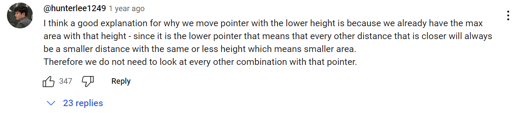

# Solution Reflections
**Reflection Guide**:
* "*Initial Approach*" covers my initial approach(es)
* "*Solution Approach*" covers the approach I used that was accepted by all Leetcode testcases
* "*Optimal Approach*" covers an approach I saw in the submissions which I deemed to be more intuitive or easier than mine
* A single asterisk (*) by a point is used to indicate that an analysis as based on a Google search
* A double question mark (??) by a point is used to indicate a lack of trust in my personal analysis

## Two Pointer Problems

### #125 Merge Sorted Array
⌛13:53:53 &nbsp;&nbsp; | &nbsp;&nbsp; See problem [here](https://leetcode.com/problems/valid-palindrome/description/?envType=study-plan-v2&envId=top-interview-150)
 
* Solution Approach: → **O(n)**, **O(1)**
  * **ALGORITHM**:
    1. Create a dictionary of valid characters using dictionary comprehesion
    2. Filter out all non-alphanumeric characters from the lowercase version of the string using list comprehension
    3. Initialise left and right pointers to the leftmost and right-most index extremes
    4. While the left pointer is less than OR EQUAL TO the right pointer:
         **WHY?** Because both pointers can point to the same element
       1. If the characters for both pointer are not the same, return False
       2. Increment the left pointer and decrement the right pointer
    5. Return True
* Optimal Approach: → **O(n)**, **O(1)**
  * **IDEA**: Same as Solution Approach but use the in-built `isalphanum()` function and remove the unnecessary string-to-list converstion in step #2
  * Improvements:
    * No re-inventing of the wheel
     **NOTE:** I wanted to use this function but, for the life of me, I could not remember what it was. 

### #392 Is Subsequence
⌛14:02:07 &nbsp;&nbsp; | &nbsp;&nbsp; See problem [here](https://leetcode.com/problems/is-subsequence/description/?envType=study-plan-v2&envId=top-interview-150)

> s: length of "needle"  
> t: length of "haystack"

* Initial Approach: → **O(t)**, **O(1)**
  * **IDEA**: Check for each s character in t from the beginning OR the position of the last s character in t
  * **ALGORITHM**:
    1. EDGE CASE: If t is an empty string and s is not, return False
    2. Initialise pointers to the beginning of s and t
    3. While we haven't exceeded the length of s:
       1. If we have exceeded the length of t, not all of s in in t so return False
       2. If the characters at the s and t pointers are the same, increment the s pointer
       3. Increment the t pointer
    4. Return True 
* Solution Approach: → **O(t)**, **O(1)**
  * **IDEA**: Same as Initial Approach but removed the unnecessary edge case handling

### #167 Two Sum II - Input Array Is Sorted
⌛15:19:18 &nbsp;&nbsp; | &nbsp;&nbsp; See problem [here](https://leetcode.com/problems/two-sum-ii-input-array-is-sorted/description/?envType=study-plan-v2&envId=top-interview-150)

* Initial Approach: → **O(n)**, **O(1)**
  * **IDEA**: Use the fact that the array is sorted to remove the need to go back and forth in the array
  * **ALGORITHM**:
    1. EDGE CASE: If there are only two elements in the array, return [1,2]
    2. Initialise left and right pointers to 0 and 1
        **WHY?** Because the left and right pointers canNOT point at the same element (according to the constraints)
    3. While the left pointer has not exceeded the end of the array:
       1. If the elements add up to the target, break
       2. If the elements add up to less than the target, shift them both forward by 1
       3. If the elements add up to more than the target, shift the left backward by 1
    4. Return an array with l+1 at the first index and r+1 in the second index
    **NOTE**: I am not sure why this worked. Yes, I came up with it and I stepped through it but I cannot directly explain the intuition behind it. Now that I think about it, I think it is just a more complex version of the optimal solution.
* Solution Approach: → **O(n)**, **O(1)**
  * **IDEA**: Same as Initial Approach but removed the unnecessary edge case handling
* Optimal Approach: → **O(n)**, **O(1)**
  * Based on my understanding of [niits' solution intuition/explanation, NOT code](https://leetcode.com/problems/two-sum-ii-input-array-is-sorted/solutions/5101915/video-using-two-pointers-to-solve-the-question-with-o-1-space)
  * **IDEA**: Start at the extents of the array and move in based on the current sum of the pointers
  * **ALGORITHM**:
    1. Initialise left and right pointers to the beginning and end index
    2. While the left pointer has not exceeded the end of the array:
       1. If the elements add up to the target, break
       2. If the elements add up to less than the target, increment the left pointer by 1
       3. If the elements add up to more than the target, decrement the right pointer by 1
    3. Return an array with l+1 at the first index and r+1 in the second index
  * Improvements:
    * Much more intuitive

**THOUGHTS**: I also thought of starting from both ends (as seen in the optimal solution) but I gave up on the idea because I wasn't sure which pointer to move. If I had sat and thought about it for a bit, I believe I would have been able to solve it.

### #11 Container with Most Water
⌛--:--:-- &nbsp;&nbsp; | &nbsp;&nbsp; See problem [here](https://leetcode.com/problems/container-with-most-water/description/?envType=study-plan-v2&envId=top-interview-150)

* Initial Approach (FAILED): → **O(n)**, **O(1)**
  * **IDEA**: Move pointer with taller neighbour on each iteration
  * **ALGORITHM**:
    1. Initialise left and right pointers to both ends of the array
    2. Initialise maximum to 0
    3. While the left pointer has not exceeded the right pointer:
       1. Set maximum to the `max()` of the current area ( = minimum of left and right values * difference of left and right) and the maximum
       2. If the height of left's right neighbour is taller than right's left neighbour, move left pointer forward by 1
       3. Else, move right pointer backward by 1
    4. Return maximum
  * Failed because ?? >>> stopped trying at 01:06:11:57
* Optimal Approach: → **O(n)**, **O(1)**
  * **IDEA**: Maximise area by starting at both extremes + Move shorter pointer on each iteration
  * **ALGORITHM**: Same as Initial Approach but step (3)(2)'s condition is: "If the height of left is smaller than the height of right" 

**NOTE**: I have no idea what the intuition behind the update condition is. Like, aren't both ideas valid ways to approach the problem? Am I losing my mind? The comment in the image below supposedly explains it... I don't know, really.

### #15 3Sum
⌛--:--:-- &nbsp;&nbsp; | &nbsp;&nbsp; See problem [here](https://leetcode.com/problems/3sum/description/?envType=study-plan-v2&envId=top-interview-150)

* Initial Approach (FAILED): → **O(n 2)**, **O(n)**
  * Failed because ?? >>> stopped trying at 48:26:14 with 310 out of 313 test cases passed (frustrating but also encouraging to not be too far from the solution)
* Optimal Approach: → **O(n 2)**, **O(n)**
  * **IDEA**: Iterate through potential values of a (where a is a member of the trio a, b, c) and implement [Two Sum II - Input Array Is Sorted](https://leetcode.com/problems/two-sum-ii-input-array-is-sorted/description/?envType=study-plan-v2&envId=top-interview-150) for the rest of the elements
  * [Neetcode's explanation AND code](https://youtu.be/jzZsG8n2R9A)
  * **ALGORITHM**:
    1. Intialise an empty list to store the valid three-element lists
    2. Sort nums using the in-built `sort()` function
    3. For each index and element in nums (using the in-built `enumerate()` function):
       1. If the current element is not the first and it is the same as the element before it, continue
       2. Set left and right pointers, l and r, to the element beside the current index and the last element in the array
       3. While l has not exceeded r:
          1. Calculate the threeSum
          2. If the threeSum is greater than 0, decrement r by 1
          3. Else If the threeSum is less than 0, increment l by 1
          4. Else:
             1. Add a list of the current element and the elements at l and r to the result list
             2. Increment l by 1 until it is not the same as the element before it OR it is right before r
    4. Return the list of valid three-element lists
  * Improvements:
    * Ensures that there is no element repitition
    * Starts l from the right of the outer loop element rather than the beginning of nums
       **NOTE**: WHY?
  * **CODE**:
  

**THOUGHTS**:
* I attribute the core idea to Hint 1 of this problem in the LeetCode terminal as seen in the quote below.
  > "*So, we essentially need to find three numbers x, y, and z such that they add up to the given value. If we fix one of the numbers say x, we are left with the two-sum problem at hand!*"

**NOTE**:
* The space complexity is dependent on the sorting algorithm implemented by the language you are using. I put O(n) because that is the maximum any language's in-built sort function would use.
* My code works when I account for element repitition in the outer loop as done in step (3)(1) of Neetcode's algorithm (I have not added this version to the code in `./two_pointer_15.py` because I do not fully understand his code - see the "WHY?" NOTE in the Improvements section of Optimal Approach)

## Markdown Resources
GitHub Emojis: https://github-emoji-picker.rickstaa.dev/