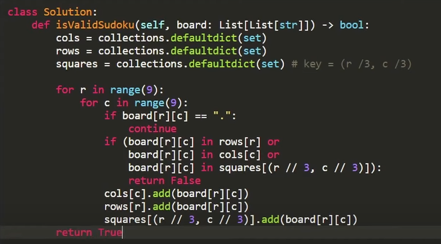
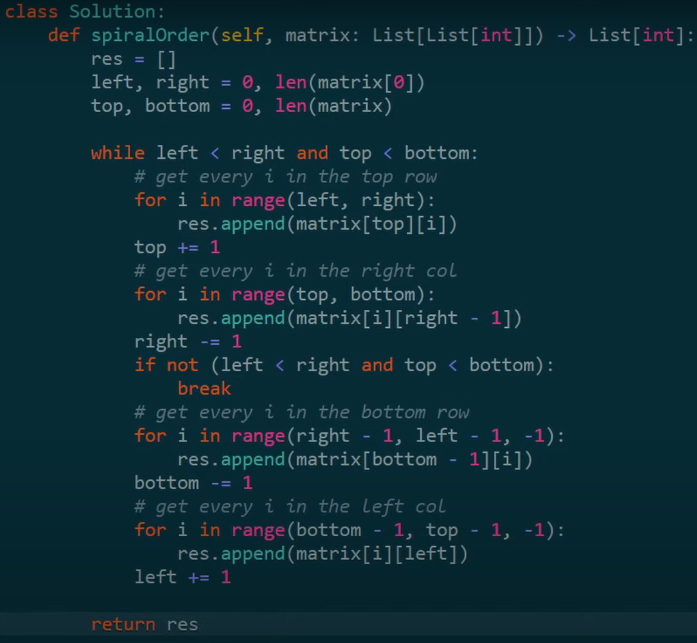

# Solution Reflections
**Reflection Guide**:
* "*Initial Approach*" covers my initial approach(es)
* "*Solution Approach*" covers the approach I used that was accepted by all Leetcode testcases
* "*Optimal Approach*" covers an approach I saw in the submissions which I deemed to be more intuitive or easier than mine
* A single asterisk (*) by a point is used to indicate that an analysis as based on a Google search
* A double question mark (??) by a point is used to indicate a lack of trust in my personal analysis
* --:--:-- in the time slot means that I couldn't solve it on my own

## Matrix Problems

### #36 Valid Sudoku
⌛43:06:55 &nbsp;&nbsp; | &nbsp;&nbsp; See problem [here](https://leetcode.com/problems/valid-sudoku/description/?envType=study-plan-v2&envId=top-interview-150)

* Initial Approach: → **O(i3)**, **O(i2)**
  * **IDEA**: For each cell, check that its value is valid within its row, column and box
  * **ALGORITHM**: See comments of `isValidSudoku_initial()` function in `./matrix_36.py`
* Solution Approach: Same as Initial Approach but different implementation for the checking of rows, columns and boxes
* Optimal Approach #1: → **O(i3)**, **O(i2)**
  * [Solution by julialokot](https://leetcode.com/problems/valid-sudoku/solutions/3277043/beats-96-78-short-7-line-python-solution-with-detailed-explanation)
  * **IDEA**: Check that there is only one of each element-row, element-column and element-box pairing using the `set()` operation
  * **ALGORITHM**: See comments of `isValidSudoku_optimal()` function in `./matrix_36.py` 
* Optimal Approach #2: 
  * [Neetcode's explanation and code](https://youtu.be/TjFXEUCMqI8)
  * **IDEA**: Same as my Solution Approach but much more streamlined
    

**THOUGHTS**: julialokot's solution is so f***ing genius to me, wow.

**NOTE**:
* The `set()` operator in Python creates a hashset (set + hashmap).
* Neetcode used the `defaultdict()` function from the `collections` library, which made me more confident in my own usage. It is very non-essential to the solution so I understand why an interview might not mind it.
* Python hashmaps only allow keys that are immutable/hashable e.g. strings, numbers and tuples (the last entry to this list is my core learning of the day). 

### #54 Spiral Matrix
⌛--:--:-- &nbsp;&nbsp; | &nbsp;&nbsp; See problem [here](https://leetcode.com/problems/spiral matrix/description/?envType=study-plan-v2&envId=top-interview-150)

* Initial Approach (FAILED): → **O(m*n)**, **O(1)**
  * **IDEA**: Keep track of the current direction and limits for the left and right
  * Failed because it was not a fully-fleshed out idea. You can see the similarities with Neetcode's approach but I did not see mine through. Theirs was also a lot more streamlined with less variables.
  * Stopped @ 26:22:70 with 19 out of 25 test cases
* Optimal Approach: → **O(m*n)**, **O(1)**
  * [Neetcode's explanation and code](https://youtu.be/BJnMZNwUk1M)
  * **IDEA**: Keep track of pointers to the left, right, top and bottom limits of the matrix as you iterate through it
  * **CODE**:
    

**TODO**: Implement Neetcode's solution based on your understanding

## Markdown Resources
GitHub Emojis: https://github-emoji-picker.rickstaa.dev/