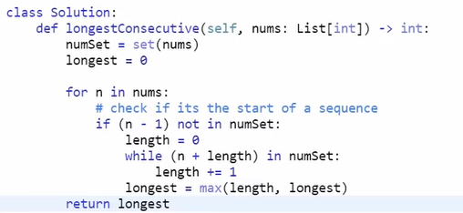

# Solution Reflections
**Reflection Guide**:
* "*Initial Approach*" covers my initial approach(es)
* "*Solution Approach*" covers the approach I used that was accepted by all Leetcode testcases
* "*Optimal Approach*" covers an approach I saw in the submissions which I deemed to be more intuitive or easier than mine
* A single asterisk (*) by a point is used to indicate that an analysis as based on a Google search
* A double question mark (??) by a point is used to indicate a lack of trust in my personal analysis
* --:--:-- in the time slot means that I couldn't solve it on my own
* 00:00:00 in the time slot means that I had already solved it before doing the Leetcode 150

## Sorting Algorithm Problems

### #383 Ransom Note
⌛07:13:08 &nbsp;&nbsp; | &nbsp;&nbsp; See problem [here](https://leetcode.com/problems/ransom-note/description/?envType=study-plan-v2&envId=top-interview-150)

> r: length of ransom note
> m: length of magazine

* Solution Approach: → **O(r+m)**, **O(1)**
  * **IDEA**: Create dictionaries of both then compare the counts for each letter in the ransom note
  * **ALGORITHM**: See comments in `./hashmap_383.py`
* Optimal Approach: → **O(n)**, **O(1)**
  * Based on [Solution by Sajal_](https://leetcode.com/problems/ransom-note/solutions/5156605/one-liner-easy-way)
  * **IDEA**: Use the `Counter` object from the Python `collections` library to count the number of character occurences in both inputs

**NOTE**: 
* You can perform arithmetic operations e.g. `-` and `+` on `Counter` objects (see [Solution by Sajal_](https://leetcode.com/problems/ransom-note/solutions/5156605/one-liner-easy-way))
* There is a `count()` function for strings in Python
  
* ### #205 Isomorphic Strings
⌛21:56:39 &nbsp;&nbsp; | &nbsp;&nbsp; See problem [here](https://leetcode.com/problems/isomorphic-strings/description/?envType=study-plan-v2&envId=top-interview-150)

> s: length of string s
> t: length of string t

* Initial Approach: → **O(s*t)**, **O(s+t)**
  * **IDEA**: Save all unique characters and where they occur in both strings then check that those indices occur in both.
  * See comments in `./hashmap_205.py`
* Solution Approach: → **O(s*t)**, **O(s+t)**
  * **IDEA**: Same as Initial Approach but used the `enumerate()` function to get access to both current index and character with an in-built Python function

### #290 Word Pattern
⌛05:34:91 &nbsp;&nbsp; | &nbsp;&nbsp; See problem [here](https://leetcode.com/problems/isomorphic-strings/description/?envType=study-plan-v2&envId=top-interview-150)

* Solution Approach: → **O(n 2)**, **O(n)**
  * **IDEA**: Map pattern characters to words using a map and return False when there is a deviation
  * **ALGORITHM**:
    1. EDGE CASE: If the pattern and words are not the same length, return False
    2. Initialise an empty dictionary, mapper, to map pattern characters to words
    3. For each pattern character and word pair (using the `zip()` in-built function):
       1. If the pattern character is NOT in the mapper
          1. If the word is in mapper, return False
          2. Assign the pattern character the value of the word
       2. Else, 
          1. If the word does not match the value of the pattern character, return False
    4. Return True if you get here

**NOTE**: Remember to deliberately consider edge cases

### #242 Valid Anagram
⌛00:00:00 &nbsp;&nbsp; | &nbsp;&nbsp; See problem [here](https://leetcode.com/problems/valid-anagram/description/?envType=study-plan-v2&envId=top-interview-150)

> s: length of string s
> t: length of string t

* Solution Approach: → **O(s+t)**, **O(s+t)**
  * **IDEA**: Compare character counts of both strings using the `Counter` object from the `collections` Python library

### #242 Group Anagrams
⌛18:15:97 &nbsp;&nbsp; | &nbsp;&nbsp; See problem [here](https://leetcode.com/problems/group-anagrams/description/?envType=study-plan-v2&envId=top-interview-150)

* Solution Approach: → **O(s+t)**, **O(s+t)**
  * **IDEA**: Use the fact that anagrams are all the same string when sorted >>> Hashmap with sorted string as key and array of strings which sort to that string as the value
  * **ALGORITHM**:
    1. Initialise an empty dictionary to group the anagrams
    2. For each string in strs:
       1. Use the `sorted()` iterable function and `join()` string method to create the string of the sorted version of the string
       2. If the sorted string is not in the dictionary's keys, add it to the dictionary and assign it an empty array
       3. Append the current string (unsorted) to its matching key's array
    3. Return a list of the dictionary's values using the `list()` function and `values()` dictionary method
* Optimal Approach:
  * **IDEA:** Same as Solution Approach but use the `defaultdict()` function from the `collections` library to handle the case where the key is not in the dictionary
  * See [Solution by rahulvarma5297](https://leetcode.com/problems/group-anagrams/solutions/3687735/beats-100-c-java-python-beginner-friendly) for a sample implementation

**NOTE**: The `defaultdict(...)` function from the `collections` library that returns a dictionary which sets the default value of a key to the specified parameter. See its usage in the `groupAnagrams_optimal()` function in `./hashmap_29.py`

### #1 Two Sum
⌛12:41:79 &nbsp;&nbsp; | &nbsp;&nbsp; See problem [here](https://leetcode.com/problems/two-sum/description/?envType=study-plan-v2&envId=top-interview-150)

* Solution Approach: → **O(n log(n))**, **O(n)**
  * **IDEA**: Use the two-pointer solution to the Two Sum II (Input Array Is Sorted) problem (see reflection for question #167 in `../2_two_pointers/Reflection.MD` and code in `../2_two_pointers/two_pointers_167.py`)
  * **ALGORITHM**:
    1. Use a hashmap to store the numbers and their original indices, which will be stored in an array
     **NOTE**: The indices are stored in an array because it is possible for there to be more than one of a single element. However, we also know that, because there is exactly one solution, if an element added to itself is the target, there will only be two occurences of that element in the array
    2. Sort the input array
    3. Set left and right pointers, l and r, to the beginning and end of the sorted array
    4. Until we find the solution:
       1. If l and r add up to the target:
          1. If the numbers are the same, return the array of indices for l, which we know has only two elements at this point
          2. Else, return the indices for l and r
       2. If l and r add up to less than the target, increment l by 1
       3. If l and r add up to more than the target, decrement l by 1
* Optimal Approach: → **O(n)**, **O(n)**
  * [Solution by niits](https://leetcode.com/problems/two-sum/solutions/5139921/video-hashmap-solution)
  * **ALGORITHM**:
    1. Create an empty dictionary to hold the elements and their indices as we traverse
    2. For each index and character in nums (using the `enumerate()` function):
       1. If the complement of the current element is in the dictionary, return the current index and the index of said complement
       2. Add the current element and its index to the dictionary
  * Improvements:
    * Improves runtime complexity
    * Does all computation in one pass, unlike my solution which requires 3 passes for hashing, sorting and then traversing
    * Much more streamlined
   **NOTE**: The Optimal Approach works when we have the elements that add to the target are the same because, it does NOT add the second occurence to the dictionary before it returns the result. Thus, you don't run into the overwriting index problem.

**THOUGHTS**: My first attempt at this problem took 9+ minutes.

### #202 Happy Number
⌛08:57:70 &nbsp;&nbsp; | &nbsp;&nbsp; See problem [here](https://leetcode.com/problems/happy-number/description/?envType=study-plan-v2&envId=top-interview-150)

* Solution Approach: → **O(??)**, **O(??)**
  * **IDEA**: Loop until you come accross the same number twice
  * **ALGORITHM**:
    1. Initialize an empty dictionary to keep track of the numbers that have already appeared
    2. Initialize a variable to hold the current number and initialise it to n
    3. Add the initial value of the variable created in step #2 to the dictionary
    4. While True:
       1. Use list comprehension, `int()` and `str()` functions to get the individual digits of the number and square them
       2. Set num to the sum of the squared digits
       3. If num is now 1, return True
       4. Else:
          1. If num is in the dictionary, we have entered a cycle so return False
          2. Add num to the dictionary 

**THOUGHTS**: Read your instructions!!! If I had properly read "...loops endlessly in a cycle...", I would have understood the break condition and where a dictionary would come in. 

**NOTE**: Figure out the time complexity for this problem

### #219 Contains Duplicates II
⌛06:53:11 &nbsp;&nbsp; | &nbsp;&nbsp; See problem [here](https://leetcode.com/problems/contains-duplicates-ii/description/?envType=study-plan-v2&envId=top-interview-150)

* Initial Approach: → **O(n)**, **O(n)**
  * **IDEA**: Use a dictionary to store the numbers and their indices, which will be stored in an array
  * **ALGORITHM**:
    1. Create a dictionary which, by default, sets each value to an array
    2. For each index and num in nums:
       1. If num is in tracker AND the difference between its last occurence and i <= k, return True
       2. Add i to the array of indices for num in the dictionary
* Solution Approach:
  * **IDEA**: Same as Initial Approach
  * Improvements:
    * Combines two if statements into one
    * Removes the unnecessary return at the end because the default return value of the function is already False

**THOUGHTS**: The solutions on Leetcode all seemed to be the same so I am guessing the ranking was primarily based on how much time it took the code to run which disadvantages people in areas with low internet connectivity, no?

### #128 Longest Consecutive Subsequence
⌛00:00:00 &nbsp;&nbsp; | &nbsp;&nbsp; See problem [here](https://leetcode.com/problems/longest-consecutive-subsequence/description/?envType=study-plan-v2&envId=top-interview-150)

* Initial Approach (FAILED): → **O(n)**, **O(n)**
  * **ALGORITHM**:
    1. EDGE CASE: If nums has a length less than 2, return its length
    2. If the Add elements to a dictionary while checking if the the number right before it (i.e. element - 1) is already in the dictionary; if so, set its value to 1 instead of 0
    3. If there is only one key in the dictionary, return 1
    4. Go through the keys in the dictionary and check if the number right before it is also in the keys + Keep track of the maximum element with a value of 1
    5. Initialize length to 1
    6. While the current number does not have a value of 1 in the dictionary:
       1. Update the number to the one right before it (i.e. num - 1)
       2. Increment length by 1
    7. Return length
  * Couldn't really wrap my head around the problem >>> stopped trying @ 24:01:32 with 22 out of 76 test cases passed
* Optimal Approach #1: → **O(n)**, **O(n)**
  * Based on understanding of [Neetcode's explanation NOT code](https://youtu.be/P6RZZMu_maU)
  * **ALGORITHM**:
    1. EDGE CASE: If nums has a length of 0, return 0
    2. Convert nums to a set
    3. Initialize a variable for the maximum consecutive sequence length, maxLength, to 1
    4. For num in the set:
       1. If the number before is the set (i.e. we have found the beginning of a sequence):
          1. Create a variable to store the current number as we parse the current sequence >>> Initialize to num
          2. Create a variable to store the current length of the current sequence >>> Initialize to 0
          3. While the current number is in the set, increment the current length and current number by 1
          4. Update maxLength to the larger of its current value and the length of the current sequence
    5. Return maxLength
* Optimal Approach #2: → **O(n)**, **O(n)**
  * Modified version of [Neetcode's code](https://youtu.be/P6RZZMu_maU)
  * **CODE**:
  
  * **ALGORITHM**:
    1. Convert nums to a set
    2. Initialize a variable for the maximum consecutive sequence length, maxLength, to 0
    3. For num in the set:
       1. If the number before is the set (i.e. we have found the beginning of a sequence):
          1. Create a variable to store the current length of the current sequence >>> Initialize to 0
          2. While the num + length is in the set, increment the current length
          3. Update maxLength to the larger of its current value and the length of the current sequence
    4. Return maxLength
  * Modifications by me:
    * Looped through the set rather than the original array (same runtime complexity but less actual operations if there are duplicates)
  * Improvements:
    * Removed the unecessary edge case handling by initializing maxLength to 0 instead of 1
    * Needs one less variable to find the length of the current sequence

**THOUGHTS**: Can you imagine that Leetcode originally had this marked as a "Hard" question then changed it to "Medium"? Insane behaviour.

**NOTE**:
* This is a popular coding interview question.
* Sets in Python are implemented with hash tables - thus, they have an insert, access and delete time complexity of O(1)

## Markdown Resources
GitHub Emojis: https://github-emoji-picker.rickstaa.dev/